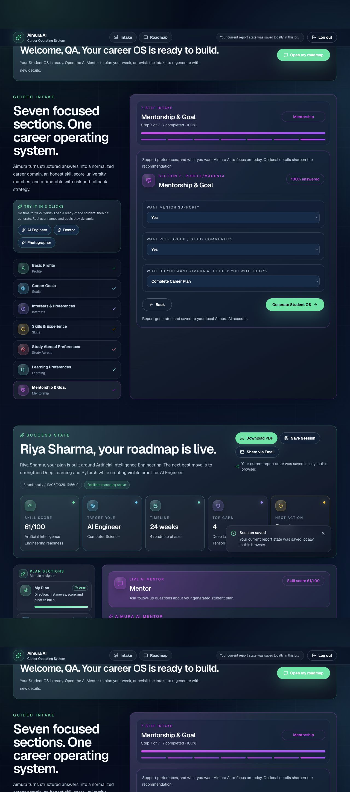

# Aimura AI

Aimura AI is a student career-planning OS. It turns a student's profile,
career goal, current skills, study preferences, country choices, budget, and
weekly availability into a generated study-to-career plan.


The app includes:

- Guided student intake with saved drafts.
- Generated My Plan dashboard with readiness score and career journey chart.
- Career Fit intelligence with market outlook, risks, and fallback routes.
- Learn, Build Proof, Study Options, Weekly Plan, and Mentor modules.
- AI Mentor chat grounded in the generated report.
- Export, save, print/PDF, and share actions.
- Local demo auth with activation and password-reset links shown inside the app.

## Team Members
Ankit Ranjan
Github link : https://github.com/ankitranjan-dsai
Uma Siva Priya
Github link : https://github.com/umapriya30

## Problem Statement

Students often receive career advice, university advice, course suggestions,
and job-preparation guidance from disconnected sources. The result is a noisy
planning experience: one tool recommends universities, another lists courses,
another gives generic career tips, and the student still has to connect those
pieces into a realistic pathway.

Aimura AI solves this by creating one grounded student plan from one intake:
career fit, skill gaps, study options, portfolio proof, weekly execution, and a
mentor that answers follow-up questions using the student's generated report.

## Architecture Diagram

```text
Student
  |
  v
Next.js UI
  |-- Login / local demo auth
  |-- Guided intake
  |-- Generated dashboard
  |-- AI Mentor chat
  |
  v
API Routes
  |-- /api/auth/*      -> local account flow
  |-- /api/insights    -> report generation
  |-- /api/mentor      -> streaming mentor answers
  |-- /api/reports     -> saved reports
  |
  v
Reasoning Layer
  |-- student-os-engine.ts  -> deterministic profile, score, roadmap
  |-- intelligence.ts       -> career intelligence enrichment
  |-- ai-provider.ts        -> Azure/OpenAI/Anthropic provider chain
  |
  v
Providers And Storage
  |-- Azure AI Foundry / Azure OpenAI
  |-- Optional OpenAI or Anthropic fallback
  |-- Offline deterministic mentor fallback
  |-- data/app-database.json for local demo storage
```

## Agent Descriptions

- Intake Agent: converts a student's profile answers into structured signals
  such as dream role, study intent, skills, budget, country preferences, and
  weekly availability.
- Career Reasoning Agent: normalizes the dream role into a field, target roles,
  required skills, missing skills, and readiness score.
- Career Intelligence Agent: produces market outlook, salary framing, risks,
  mitigations, fallback options, and a detailed weekly timetable.
- Roadmap Agent: builds staged plan phases and converts them into a career
  journey chart and Weekly Plan timeline.
- Mentor Agent: answers follow-up questions through `/api/mentor`, grounded in
  the generated report and live provider chain.
- Safety Agent: keeps claims honest, avoids guarantees, and reminds students to
  verify official university, visa, scholarship, salary, and job details.

## Innovation

- Combines study planning and career execution instead of treating them as separate workflows.
- Uses a generated report as the memory/context for the AI Mentor, so answers
  are specific to the student's goal, skills, gaps, roadmap, country, and
  budget.
- Keeps the product demoable without paid AI access through a deterministic
  offline reasoning path.
- Supports formal-study and non-study pathways, so students are not forced into
  university recommendations when they choose flexible routes.
- Shows visible readiness scoring and journey progress rather than a vague
  recommendation list.

## Impact

Aimura AI helps students move from uncertainty to action. A student can finish
the intake and immediately see:

- Where they stand now.
- Which skills matter most.
- What proof they should build.
- Which study options fit their situation.
- What to do this week.
- How to ask a mentor targeted follow-up questions.

For schools, counsellors, and hackathon demos, it provides a repeatable way to
generate structured, explainable career guidance without exposing private API
keys or requiring a production database.

## Screenshots

Screenshots are included in the repository:

```text
screenshots/aimura-next-desktop.png
screenshots/aimura-next-mobile.png
screenshots/aimura-career-os-desktop.png
screenshots/aimura-career-os-mobile.png
```

You can embed them in GitHub later with Markdown image links, for example:

```md

```
## Live
https://aimura-ai.vercel.app/

## Demo Video

Youtube video link: https://youtu.be/J5HeCbWI4BI


## Tech Stack

- Next.js App Router
- React
- TypeScript
- Tailwind CSS
- Lucide icons
- Local JSON storage for demo accounts and saved reports
- Azure AI Foundry / Azure OpenAI for live reasoning
- Optional OpenAI or Anthropic fallback providers

## AI Mentor And API Behavior

The Mentor tab has two different parts:

- Suggestion chips are static starter prompts, such as "What should I do this
  week?" or "What project should I build?"
- The actual mentor answer is generated by `/api/mentor`.

Provider order:

1. Microsoft Foundry IQ / Azure AI Foundry
2. Anthropic, if configured
3. OpenAI, if configured
4. Offline deterministic mentor, if no live provider works

The offline mentor is intentional so demos never break, but if Azure is
configured correctly the Mentor header should show:

```text
Powered by Microsoft Foundry IQ
```

The app accepts either Azure key variable name:

```env
AZURE_OPENAI_KEY=your_key
# or
AZURE_OPENAI_API_KEY=your_key
```

The app also accepts these Azure deployment variable names:

```env
AZURE_DEPLOYMENT_NAME=gpt-4o-mini
AZURE_OPENAI_DEPLOYMENT_NAME=gpt-4o-mini
AZURE_OPENAI_DEPLOYMENT=gpt-4o-mini
```

You must restart the Next.js dev server after changing `.env`.

## Environment Setup

Copy `.env.example` to `.env` and fill only the providers you want to use.

Required for Microsoft Foundry IQ / Azure AI Foundry:

```env
AZURE_OPENAI_ENDPOINT=https://YOUR-RESOURCE.openai.azure.com/
AZURE_OPENAI_KEY=YOUR_KEY
AZURE_OPENAI_API_KEY=
AZURE_DEPLOYMENT_NAME=gpt-4o-mini
AZURE_OPENAI_API_VERSION=2024-10-21
```

Optional fallback providers:

```env
OPENAI_API_KEY=
AIMURA_BACKUP_MODEL=gpt-4o-mini

ANTHROPIC_API_KEY=
AIMURA_PRIMARY_MODEL=
```

Never commit `.env`.

## Run Locally

Install dependencies:

```bash
npm install
```

Start the app:

```bash
npm run dev -- --hostname 0.0.0.0 --port 3000
```

Open:

```text
http://localhost:3000
```

Windows users can also double-click:

```text
open_aimura_windows.bat
```

macOS users can run:

```bash
./open_aimura_ai.command
```

## Build

```bash
npm run build
```

Note: the production build may need network access because `next/font` fetches
Google-hosted Geist fonts during build.

## Project Structure

```text
src/
|-- app/
|   |-- api/
|   |   |-- auth/       # signup, login, activation, forgot/reset password
|   |   |-- insights/   # report generation and AI career intelligence
|   |   |-- mentor/     # streaming mentor chat API
|   |   `-- reports/    # saved reports
|   |-- globals.css     # Tailwind theme and global UI styles
|   |-- layout.tsx
|   `-- page.tsx
|-- components/
|   |-- MultiStepForm.tsx
|   |-- ReportDashboard.tsx
|   |-- JourneyChart.tsx
|   |-- MentorChat.tsx
|   |-- RoadmapTimeline.tsx
|   |-- ModuleSidebar.tsx
|   |-- PremiumUI.tsx
|   `-- ExportActions.tsx
`-- lib/
    |-- ai-provider.ts       # live provider chain
    |-- intelligence.ts      # career intelligence enrichment
    |-- student-os-engine.ts # deterministic report engine
    |-- app-data-store.ts    # local JSON demo storage
    `-- student-os-types.ts
```

Python support files and tests are also included for the original reasoning
pipeline:

```text
agent.py
app.py
pipeline.py
student_os.py
scorer.py
tests/
scripts/
```

## Data Storage

Local demo accounts and generated reports are stored in:

```text
data/app-database.json
```

This file is gitignored because it can contain real user/demo data.

Static sample data that is safe to commit:

```text
data/career_roles.csv
data/countries.csv
data/exams.csv
data/fields.csv
data/universities_sample.csv
```


## Safety

Aimura AI provides educational and career guidance only. It does not guarantee
admission, visas, scholarships, salaries, or job offers. Students should verify
official details with universities, visa authorities, scholarship providers,
and employers.
